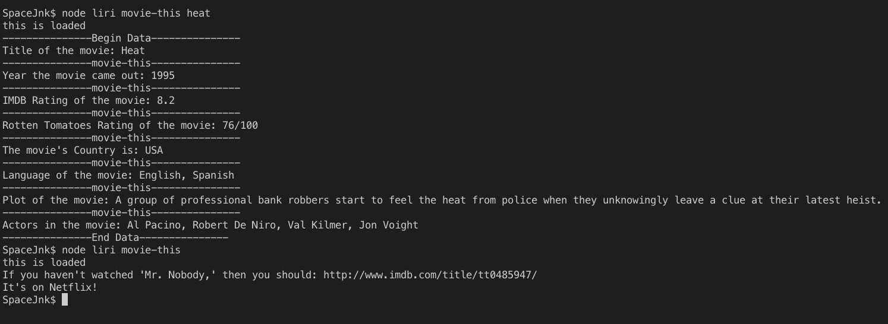

# liri-node-app 

    LIRI will search Spotify for songs, Bands in Town for concerts, and OMDB for movies.

+ create GitHub repository called liri-node-app
+ clone it to your computer.

+ requests axios package to the Bands in Town, Spotify and OMDB APIs. 
+ All these Node packages below are available in [NPM](https://www.npmjs.com/package/npm-api)

 + npm init before get dependencies
## Build with these dependencies from NPM
#### Node-Spotify-API
#### Axios
#### Moment
#### DotEnv
#### Bandsintown

 
Use Axios to grab data from the OMDB API and the Bands In Town API

### File Storage for js code 
    + keys.js 
    + liri.js
    + .env file
    + random.txt file

#### node liri.js spotify-this-song   ->'song name here'<-

 + This will search the Bands in Town Artist Events API ("https://rest.bandsintown.com/artists/" + artist + "/events?app_id=codingbootcamp") for an artist and render the following information about each event to the terminal:

Name of the venue

Venue location

Date of the Event (use moment to format this as "MM/DD/YYYY")

#### node liri.js concert-this ->'artist/band name here'<-

 + This will show the following information about the song in your terminal/bash window

Artist(s)

The song's name

A preview link of the song from Spotify

The album that the song is from

#### node liri.js movie-this ->'movie name here'<-

 + This will output the following information to your terminal/bash window:

  * Title of the movie.
  * Year the movie came out.
  * IMDB Rating of the movie.
  * Rotten Tomatoes Rating of the movie.
  * Country where the movie was produced.
  * Language of the movie.
  * Plot of the movie.
  * Actors in the movie.

#### node liri.js do-what-it-says

  + Using the fs Node package, LIRI will take the text inside of random.txt and then use it to call one of LIRI's commands.

  + It should run spotify-this-song for "I Want it That Way," as follows the text in random.txt.

